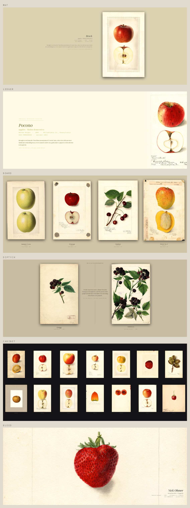

# USDA Pomological Watercolors

7,584 paintings of fruit and nut varieties, made for the U.S. Department of
Agriculture between 1886 and 1942, composed into wallpapers for the screen you
actually have — and set on your desktop, lock screen and login screen.

Government botanical illustration, back when documenting a new apple cultivar
meant commissioning a watercolour of it. Deborah Griscom Passmore alone painted
1,516 of these.



<sub>Top to bottom: <code>mat</code>, <code>ledger</code>, <code>board</code>, <code>diptych</code>, <code>cabinet</code>, <code>bleed</code>.</sub>

## The problem this is actually solving

The paintings are portrait, median aspect **0.65**. Screens are not.

A phone at ~0.46 is *narrower* than the paintings, so filling it crops the
width. An ultrawide monitor is the opposite problem and a much worse one: at
**3440 × 1440** the screen is 2.39:1 — three and a half plates wide — so
stretching one painting across it throws away about **85% of the image**.

So none of the six treatments fill the screen with a single plate. Each is a
different answer to "what goes in all that width", ordered by how far they
drift from "a painting on a wall":

| Treatment | What goes in the width |
| --- | --- |
| `mat` | one sheet floated on a mat sampled from its own paper; the rest is wall |
| `ledger` | the sheet bled off the right edge, catalogue entry set on the left |
| `board` | four specimens in a row, as if pinned to one card |
| `diptych` | two varieties of one fruit, facing across a centre rule |
| `cabinet` | fourteen plates on the copy-stand black, as a drawer pulled out |
| `bleed` | edge to edge, but cropped to the plate's busiest band — the fruit |

Run `python3 prototypes/build_desktop.py` and open `prototypes/desktop.html`
to compare all six at your own resolution, with a toggle that overlays your
panel, dock and icons.

## Quick start

```sh
nix run github:YOU/pomological-watercolors -- db          # catalogue, ~4 MB
nix run github:YOU/pomological-watercolors -- fetch --limit 200
nix run github:YOU/pomological-watercolors -- prepare --all
nix run github:YOU/pomological-watercolors -- set
```

Without nix, it is Python 3 and Pillow and nothing else:

```sh
git clone https://github.com/YOU/pomological-watercolors && cd $_
pip install pillow          # or: nix develop
scripts/pom db && scripts/pom fetch --limit 200 && scripts/pom prepare --all
scripts/pom set
```

`--limit 200` fetches a sample. The full set is **~56 GB** and takes about
1h45m — throughput against archive.org tops out near 9 MB/s regardless of how
many workers you use. The download is resumable, idempotent and verified
against the Archive's published MD5s, and partial files are staged as `.part`
so an interrupted run can never leave a truncated JPEG behind.

Everything that writes takes `--dry-run`. Everything takes `--help`.

## Keeping it there

```sh
pom install                      # rotation + whatever the lock screen needs
pom install --treatment diptych  # pin one treatment instead of cycling
pom status
```

### It changes in the dark

A wallpaper that swaps while you are reading the screen is a distraction, and
the fix is not a slower timer — it is to **only ever change across a dark
boundary**. `pom install` sets up a watcher that listens for the screen
locking (`ActiveChanged`, on whichever of the xfce/gnome/freedesktop
screensaver interfaces your desktop uses) and composes the next plate then,
gated to at most one change an hour. Unlocking reveals a picture that was
already there.

`--mode timer` is available for desktops that do not announce locking, and is
worse for exactly the reason above.

### It shows you everything before it repeats

Selection walks a shuffled ring and retires **only the plates it actually
displays** — 2 for a diptych, 14 for a cabinet. Nothing repeats until
everything has been seen: at one change an hour over the full collection,
**224 days**. Preparing more scans shuffles them into the unshown set rather
than restarting.

## Which desktops work

The composing is portable; the *setting* is not. Each desktop is a backend,
and each reports honestly per surface — `ok`, `unsupported`, or `needs-setup`
— rather than failing quietly. Override detection with `--desktop`.

| Desktop | Wallpaper | Lock screen | Login screen |
| --- | --- | --- | --- |
| XFCE | `xfconf` backdrop keys, per monitor | stock slideshow saver (see below) | SDDM, via the NixOS module |
| GNOME | `gsettings`, light and dark | `org.gnome.desktop.screensaver` | GDM needs gresource surgery — not attempted |
| KDE Plasma | `plasma-apply-wallpaperimage` | `kscreenlockerrc` | SDDM, via the NixOS module |
| sway / Hyprland | `swaybg` | no shared mechanism | greeter-dependent |
| bare X11 | `feh` or `xwallpaper` | none | none |

**The XFCE lock screen keeps exactly one image on purpose.** Its stock
slideshow saver has no interval option, and measured over four minutes it
cycles whatever it finds in its folder *about once a second* — a strobe, not a
slideshow. With one file it holds still and the plate changes when the
rotation changes it. `--lock-keep` raises it if you want the strobe.

**The login screen needs root**, on any desktop. The greeter runs as its own
user before any session exists and cannot read `$HOME`, which is mode 0700 on
most systems. So the rotation drops a world-readable copy in
`/var/lib/pomological` and the greeter theme points at that path. On NixOS
that is `nix/nixos-module.nix`; elsewhere, point your greeter at the same file
by hand.

## On NixOS

```nix
{
  inputs.pomological.url = "github:YOU/pomological-watercolors";

  # system: the greeter half, which is the part that needs root
  imports = [ inputs.pomological.nixosModules.default ];
  services.pomological.login = { enable = true; user = "alice"; };

  # home-manager: the rotation
  imports = [ inputs.pomological.homeModules.default ];
  services.pomological = { enable = true; treatment = "diptych"; };
}
```

`nix develop` gives you Python + Pillow for hacking on it.

## The botanical note

Compositions with room for it carry a note about the species, in two halves
kept deliberately apart:

* **the sentence** is authored, in `data/botany.json`, one per species. Held to
  what is uncontroversial about the plant or its arrival in American orchards
  — never about the individual variety, which would be 7,584 claims nobody can
  check. 59 entries cover **98.2%** of the plates, because the collection is
  wildly skewed: apples alone are half of it, twenty species are 95%.
* **the fact** underneath is computed from the catalogue at render time — how
  many plates of this species there are, and the years they span. Never
  hand-maintained, so it cannot drift as more scans are prepared.

A species with no entry gets no note and the layout closes the gap. Adding one
is a single line of JSON.

## Where the data comes from

The NAL discovery portal is the catalogue of record but not a practical bulk
source — guest sessions are capped at `offset < 1000`, so the full 7,584
records cannot be paged out, and the Alma-D viewer serves a 100×100 placeholder
over any simple URL. The Internet Archive carries complete public-domain
mirrors.

| Source | Role |
| --- | --- |
| [`usda-pomological-watercolor-collection`](https://archive.org/details/usda-pomological-watercolor-collection) | 7,581 full-resolution JPEGs (~56 GB), with MD5s |
| [`usda_pomological_watercolors_20200211`](https://archive.org/details/usda_pomological_watercolors_20200211) | `pom_metadata.csv` — NAL's metadata export, 7,583 rows |
| [NAL Primo](https://search.nal.usda.gov/) | confirms the 7,584 total, fills records the CSV misses |

Neither mirror alone is complete and the gaps do not overlap: the CSV has no
row for `POM00007584`, and the image item has no scan for `POM00000390`,
`POM00001143` or `POM00007550`. Those three are catalogued paintings with no
publicly retrievable scan anywhere — NAL's own download page returns an HTML
stub. They are kept as rows with `scan_status = 'no_public_scan'` rather than
quietly dropped. The union is exactly 7,584.

## How the scans become plates

The raw files are photographs of a sheet on a dark copy-stand, not cropped
artwork. `pom prepare` finds the sheet inside the backdrop and crops to it,
then measures a luminance/detail grid and the paper tone, which is what lets a
composition decide where text is safe, what colour the mat should be, and —
for `bleed` — which band of the plate holds the fruit.

```
pom db        sources        -> data/pom.sqlite
pom fetch     pom.sqlite     -> data/originals/*.jpg   (~56 GB)
pom prepare   originals      -> data/wallpapers/*.jpg  (1800 px tall, ~1.3 GB)
pom compose   wallpapers     -> one screen-sized image
pom set       that image     -> desktop, lock, login
```

Set `POMOLOGICAL_DATA` to keep that somewhere other than `./data`.

### Schema

`items` — one row per catalogued painting (7,584)

| column | notes |
| --- | --- |
| `pom_id`, `seq` | `POM00000266` and its numeric form, for ordering |
| `artist` | 26 distinct; Passmore alone painted 1,516 |
| `sci_name`, `common_name`, `variety` | `Malus domestica` / `apples` / `York` |
| `geo_origin` | where the specimen was grown |
| `year`, `date_created` | 1886–1942 |
| `sources` | which of `csv,ia,nal` supplied the row |
| `scan_status` | `available` or `no_public_scan` |

`ia_files` — the Archive's inventory. `downloads` — what has been fetched, its
on-disk MD5, and any error.

## Licence

Code is MIT. The paintings are public domain and need no licence, but the
National Agricultural Library asks that use carry:

> U.S. Department of Agriculture Pomological Watercolor Collection. Rare and
> Special Collections, National Agricultural Library, Beltsville, MD 20705.

Scans are trimmed, composed and analysed entirely on your machine. No image
leaves it.
